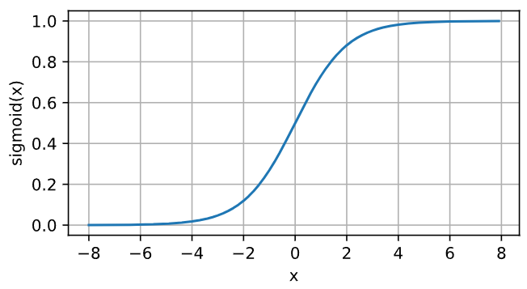
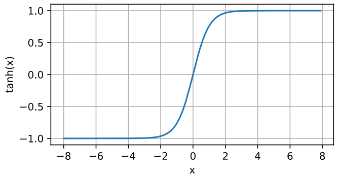

# 神经网络与深度学习2

在之前我们说过，神经网络其实就是多个输入通过多种的线性和非线性组合来获得的输出。若对于神经网络的结构还存有疑惑，可以打开这个网址“[从函数到神经网络【白话DeepSeek01】_哔哩哔哩_bilibili](https://www.bilibili.com/video/BV1uGA3eLEeu?spm_id_from=333.788.videopod.sections&vd_source=a9e7307fd7cf6202b163a39b03746807)”，这个视频很好地讲述了神经网络每个层之间的关系以及神经元与神经元之间的关系。

这期文章我们将真正进入深度神经网络，首先需要从多层感知机开始。

【温馨提示】这一期公式稍微有亿点多，但原理和之前所说的梯度下降法大差不差，若是对梯度下降法的原理还不太清晰，可以观看视频“[【梯度下降】3D可视化讲解通俗易懂_哔哩哔哩_bilibili](https://www.bilibili.com/video/BV18P4y1j7uH/?spm_id_from=333.1007.top_right_bar_window_history.content.click)”。

## 多层感知机

在前面的神经网络模型中只有输入层和输出层，这样的一个神经网络就是单层神经网络。


$$
z_1 = w_{11} x_1 + w{12} x_2 + w{13} x_3 + w_{14} x_4 (线性输出部分)
$$

$$
o_1 = f(z_1) (在线性输出部分作用一个激活函数作为最终的输出)
$$

这样的单层神经网络有一个限制：无论你在输出层中使用什么样的激活函数，其输出都只依赖于线性输出部分。即在一个分类模型中，激活函数作用之前的非线性输出部分可能是（举个例子）：

$$
z_1^{(1)} = 1, z_2^{(1)}=10,z_3^{(1)}=2
$$

在这个时候，我们就已经可以将样本1分到类别2中了，无论我们使用什么样的激活函数，都不会改变其最终结果，例如sigmoid函数：

$$
o_1^{(1)} = \sigma (z_1^{(1)}) = \frac{1}{1+e^{-z_1^{(1)}}} \approx 0.73106
$$

$$
o_2^{(1)} = \sigma (z_2^{(1)}) = \frac{1}{1+e^{-z_2^{(1)}}} \approx 0.99995
$$

$$
o_3^{(1)} = \sigma (z_3^{(1)}) = \frac{1}{1+e^{-z_3^{(1)}}} \approx 0.88080
$$

最终还是将样本1分到类别2中。因此虽然这个输出层中使用了一个非线性的激活函数，但本质上还是一个线性模型。

为了突破这个限制，我们可以在网络中加入一个或多个隐藏层，使其能够处理更普遍的函数关系。最简单的办法就是将许多个全连接层堆在一起，并将本层的输出作为下一层的输入，直至输出层。

【注】：全连接层是指某一层中的每一个神经元都与上一层中的所有神经元相连接（输入层除外），这样的层就叫做全连接层。

下面我们讨论的多层感知机只讨论全为全连接层的情况，即全连接网络。四个输入节点、五个隐藏节点、三个输出节点的两层全连接网络可如下表示：


以输出o_1为例，可以写出其表达式：

$$
y_1 = f_1^{[2]}(z_1^{[2]})
$$

$$
z_1^{[2]} = h_1w_{11}^{[2]} + h_2w_{21}^{[2]} + h_3w_{31}^{[2]} + h_4 w_{41}^{[2]}+ w_{51}^{[2]}h_5 + b_1^{[2]}
$$

$$
h_1 = f_1^{[1]}(z_1^{[1]})
$$

$$
h_2 =f_2^{[1]}(z_2^{[1]})
$$

$$
h_3 =f_3^{[1]}(z_3^{[1]})
$$

$$
h_4 = f_4^{[1]}(z_4^{[1]})
$$

$$
h_5 = f_5^{[1]}(z_5^{[1]})
$$

$$
z_1^{[1]} = x_1w_{11}^{[1]} + x_2w_{21}^{[1]} + x_3w_{31}^{[1]} + x_4w_{41}^{[1]}+ b_1^{[1]}
$$

$$
z_2^{[1]} = x_1w_{12}^{[1]} + x_2w_{22}^{[1]} + x_3w_{32}^{[1]} + x_4w_{42}^{[1]}+ b_1^{[1]}
$$

$$
z_3^{[1]} = x_1w_{13}^{[1]} + x_2w_{23}^{[1]} + x_3w_{33}^{[1]} + x_4w_{43}^{[1]}+ b_1^{[1]}
$$

$$
z_4^{[1]} = x_1w_{14}^{[1]} + x_2w_{24}^{[1]} + x_3w_{34}^{[1]} + x_4w_{44}^{[1]}+ b_1^{[1]}
$$

$$
z_5^{[1]} = x_1w_{15}^{[1]} + x_2w_{25}^{[1]} + x_3w_{35}^{[1]} + x_4w_{45}^{[1]}+ b_1^{[1]}
$$

写成紧密形式：

$$
\mathbf{\hat{Y}} = \mathbf{F}^{[2]}(\mathbf{Z}^{[2]})
$$

$$
\mathbf{Z}^{[2]} = \mathbf{H} \mathbf{W}^{[2]}  + \mathbf{b}^{[2]}
$$

$$
\mathbf{H} = \mathbf{F}^{[1]}(\mathbf{Z}^{[1]})
$$

$$
\mathbf{Z}^{[1]} = \mathbf{X} \mathbf{W}^{[1]} + \mathbf{b}^{[1]}\\
$$

【注】这里的[1]和[2]分别表示第一层和第二层，**F**( · )表示激活函数。

### 常见的激活函数

#### ReLU函数

修正线性单元（rectified linear unit, ReLU），ReLU是目前最受欢迎的激活函数，因为其不会像sigmoid函数一样出现“梯度消失“（稍后讨论），同时也能产生很好的效果。其定义为：对于给定元素x，ReLU函数返回的是该元素x与0中的最大值，即

$$
ReLU(x) = \max(x,0)
$$

通俗地说就是当x小于零的时候函数返回0，当x大于零的时候返回x。

```python
import torch
from d2l import torch as d2l

# 1.ReLU函数
x = torch.arange(-8.0, 8.0, 0.1, requires_grad=True)
y = torch.relu(x) # 输入为负时，函数的导数值为0；输入为正时，函数的导数值为1
d2l.plot(x.detach(), y.detach(), 'x', 'relu(x)', figsize=(5, 2.5))
```


ReLU(x)有很多变体，包括参数化ReLU(pReLU): 

$$
pReLU(x) = \max (x, 0) + \alpha \min (0, x)
$$

#### sigmoid函数

对于任意一个实数域的输入，可以将其压缩到范围为0到1的输出。

$$
sigmoid(x) = \frac{1}{1+e^{-x}}
$$

```python
# 2.sigmoid函数
y = torch.sigmoid(x)
d2l.plot(x.detach(), y.detach(), 'x', 'sigmoid(x)', figsize=(5, 2.5))
```



#### tanh函数（双曲正切）

与sigmoid函数类似，tanh函数也能将任意实数域上的输入压缩到-1到1的范围输出：

$$
sigmoid(x) = \frac{1-e^{-2x}}{1+e^{-2x}}
$$

```python
# 3.tanh函数（双曲正切）
y = torch.tanh(x)
d2l.plot(x.detach(), y.detach(), 'x', 'tanh(x)', figsize=(5, 2.5))
```



### 损失函数与随机梯度下降

假设一个有L层的网络，输入为第0层，共有d个输入，输出为第L层，共有q个输出，第l个隐藏层共有h_l个神经元，则：

$$
输出层:\hat{y_i} = a_i^{[L]} = a_i(输出层可以省略上标)
$$

$$
输入层:x_i = a_i^{[0]}
$$

$$
第l层的第i个输出:a_i^{[l]} =f_i^{[l]}(z_i^{[l]})
$$

$$
损失函数与所有层的权重和偏置相关:J(\mathbf{W}, \mathbf{b})

$$
将每一层的权重和偏置合并为一个参数W
$$

\mathbf{X} = \begin{bmatrix}
1&x_1&x_2&...&x_{d}
\end{bmatrix}_{1 \times (1+d)}\\

\mathbf{W}^{[l]} = \begin{bmatrix}
\mathbf{b^{[l]}}\\
\mathbf{w_1^{[l]}}\\
\mathbf{w_2^{[l]}}\\
...\\
\mathbf{w_{h_l}^{[l]}}
\end{bmatrix}_{(1+h_{l}) \times h_{l+1}} \\

\mathbf{H}^{[l]} = \begin{bmatrix}
1 & h_1^{[l]} & h_2^{[l]} & ... & h_{h_{l}}^{[l]}
\end{bmatrix}_{1 \times (1+h_{l})} = \mathbf{F}^{[l]}(\mathbf{Z}^{[l]})_{1 \times (1+h_{l})}\\
\mathbf{Z}^{[l]} =  \mathbf{H}^{[l-1]}_{1 \times (1+h_{l-1})} \mathbf{W}^{[l-1]}_{(1+h_{l-1}) \times (h_{l})}
$$
由每个向量右下角的维度可以看出，每一层隐藏层计算时，都是**手动**在下一层的输入最前面加上元素“1”，例如：从输入层（第0层）到第1层时，是一个1×(1+d)维度的向量与一个维度为(1+d)×h_1的矩阵W相乘，得出的线性输出Z^[1]应该是h_1维的，然后再对其使用激活函数（不会影响向量维数）；但是第1层传入到第2层时，就变成了(1+h_2)维，即在传入下一层之前，会在本层的输出向量最前面加一个元素"1"，以便于下一层计算偏置。

【注】这里的“1”只是在推导数学公式时为了便于理解和推导而手动添加的，在代码中不用考虑每一层都添加“1”。

为了方便使用梯度下降法，将所有层的参数矩阵W都放入一个列向量Θ中：
$$
\Theta = \begin{bmatrix} vec(\mathbf{W}^{[1]})\\
vec(\mathbf{W}^{[2]})\\
...\\
vec(\mathbf{W}^{[L]})
\end{bmatrix}
=
\Theta = \begin{bmatrix} b_1^{[0]}\\
b_2^{[0]}\\
...\\
b_{h_1}^{[0]}\\
w_{11}^{[0]}\\
w_{12}^{[0]}\\
...\\
w_{d,h_1}^{[0]}\\
b_1^{[1]}\\
...\\
w_{h_{L-1},q}^{[L]}\\

\end{bmatrix}=
\begin{bmatrix} \theta_1\\
\theta_2\\
...\\
\theta_{(1+h_{L-1}) \times q}\\

\end{bmatrix}
$$
将损失函数设为均方误差，即：
$$
J(\Theta) = \frac{1}{2} \sum_{j=1}^q (y_j - \hat{y}_j)^2\\
令:e_j = y_j - \hat{y}_j,则J(\Theta) =\frac{1}{2} \sum_{j=1}^q (e_j)^2\\
\mathbf{e} = \begin{bmatrix} 
e_1\\
e_2\\
...\\
e_q
\end{bmatrix}
$$
BP算法的基本思想：
①设置初始系数Θ为较小的随机非零值；
②给定输入/输出样本对，计算网络输出，完成前向传播；
③计算目标函数 J 。如 J<ε ，则训练成功，退出；否则转入④；
④反向传播计算由输出层，按照梯度下降法将误差反向传播，逐层调整权值，转入②。

设置初始系数值为Θ0，k时刻的系数值为Θk，使用泰勒级数展开，则有：
$$
J(\Theta_{k+1}) = J(\Theta_k) + (\frac{dJ}{d\Theta})^T\Delta \Theta_k+...\\
忽略高阶项:J(\Theta_{k+1}) = J(\Theta_k) + (\frac{dJ}{d\Theta})^T\Delta \Theta_k
$$
需要选择合适的ΔΘk使得损失函数 J 最小。
$$
最直接的办法就是令\Delta \Theta_k = - \alpha \frac{dJ}{d\Theta}\\
此时J(\Theta_{k+1}) = J(\Theta_k) - \alpha (\frac{dJ}{d\Theta})^2
$$
这样都可以保证每一次训练之后所得到的损失函数都会比训练之前的损失函数更小，从而收敛到最小。

$$
J(\Theta) = \frac{1}{2} \sum_{j=1}^q (y_j - \hat{y}_j)^2 = \frac{1}{2} \sum_{j=1}^q(e_j)^2
$$
此时：
$$
\frac{dJ}{d\Theta} = 
\begin{bmatrix}
\frac{\partial J}{\partial \theta_1}\\
\frac{\partial J}{\partial \theta_2}\\
...\\
\frac{\partial J}{\partial \theta_{(1+h_{L-1})} \times q}
\end{bmatrix}
$$

1. 先讨论权重的情况：

$$
\frac{\partial J}{\partial w_{ij}^{[l]}}=\frac{\partial J}{\partial e_i} \frac{\partial e_i}{\partial w_{ij}^{[l]}}\\
$$

​	当l=L时：
$$
\frac{\partial J}{\partial w_{ij}^{[L]}}=\frac{\partial J}{\partial e_i} \frac{\partial e_i}{\partial h_i^{[L]}} \frac{\partial h_i^{[L]}}{\partial z_i^{[L]}} \frac{\partial z_i^{[L]}}{\partial w_{ij}^{[L]}}\\
$$

$$
因为J = \frac{1}{2}\sum_{i=1}^q(e_i)^2\\
\frac{\partial J}{\partial e_i} = e_i\\
$$

$$
因为e_i=y_i-h_i^{[L]}\\
\frac{\partial e_i}{\partial h_i^{[L]}} = -1\\
$$

$$
因为h_i = f_i(z_i),这里所有的f(·)都是sigmoid函数\\
\frac{d(sigmoid(x))}{dx}=sigmoid(x)(1-sigmoid(x))\\

\frac{\partial h_i^{[L]}}{\partial z_i^{[L]}} = h_i^{[L]}(1-h_i^{[L]})\\
$$

$$
z_i^{[L]} = \sum_{j=0}^{h_{L-1}} w_{ij}^{[L]}h_j^{[L-1]}\\

\frac{\partial z_i^{[L]}}{\partial w_{ij}^{[L]}} = h_j^{[L-1]}
$$

​	综上
$$
\frac{\partial J}{\partial w_{ij}^{[L]}} = -e_i h_i^{[L]}(1-h_i^{[L]})h_j^{[L-1]}\\
令\delta_i^{[L]}=e_i h_i^{[L]}(1-h_i^{[L]}),则\Delta w_{ij}^{[L]}(k)=\alpha \delta_i^{[L]}h_j^{[L-1]}
$$
​	当l < L时：
$$
\frac{\partial J}{\partial w_{ij}^{[l]}}=\frac{\partial J}{\partial e_i} \frac{\partial e_i}{\partial h_i^{[L]}} \frac{\partial h_i^{[L]}}{\partial z_i^{[L]}} \frac{\partial z_i^{[L]}}{\partial h_i^{[L-1]}}\frac{\partial h_i^{[L-1]}}{\partial z_i^{[L-2]}}...\frac{\partial h_i^{[l+1]}}{\partial z_i^{[l]}}\frac{\partial z_i^{[l]}}{\partial w_{ij}^{[l]}}\\
\frac{\partial z_i^{[l]}}{\partial w_{ij}^{[l]}} = h_j^{[l-1]}\\
\frac{\partial J}{\partial w_{ij}^{[l]}}=-(\sum_{j=1}^m w_{ji}^{[l+1]}\delta_{j}^{[l+1]})(h_i^{[l]})^\prime h_j^{[l-1]}
$$
​	经过整理后可得：
$$
令\delta_i^{[l]}=(\sum_{j=1}^m w_{ji}^{[l+1]}\delta_{j}^{[l+1]})(h_i^{[l]})^\prime ,则
\Delta w_{ij}^{[l]} = \alpha \delta_i^{[l]}h_j^{[l-1]}
$$
​	总结来说，对于权重系数，均可表示为：
$$
\Delta w_{ij}^{[l]} = \alpha \delta_i^{[l]}h_j^{[l-1]}\\
\frac{\partial J}{\partial z_i^{[l]}}= -\delta_i^{[l]}\\
当l=L时:\delta_i^{[L]}=e_i h_i^{[L]}(1-h_i^{[L]})\\
当l<L时:\delta_i^{[l]}=(\sum_{j=1}^m w_{ji}^{[l+1]}\delta_{j}^{[l+1]})(h_i^{[l]})^\prime
$$

2. 然后来讨论偏置

​	已知：
$$
z_i^{[l]}=\sum_j w_{ij}^{[l]}h_j^{[l-1]} + b_i^{[l]}
$$
​	因此
$$
\frac{\partial J}{\partial b_i^{[l]}} = \frac{\partial J}{\partial z_i^{[l]}}\frac{\partial z_i^{[l]}}{\partial b_i^{[l]}}且\frac{\partial J}{\partial z_i^{[l]}}= -\delta_i^{[l]},\frac{\partial z_i^{[l]}}{\partial b_i^{[l]}}=1\\
\frac{\partial J}{\partial b_i^{[l]}} =\delta_i^{[l]}·1=-\delta_i^{[l]}\\
\Delta b_i^{[l]}=-\alpha\frac{\partial J}{\partial b_i^{[l]}}=\alpha \delta_i^{[l]}
$$

3. 参数更新：在整个神经网络中，系数的更新是从输出层向输入层更新，即从L层、L-1层、...、1层的顺序、使用梯度下降法进行更新：
   即当 l > 0 时

$$
w_{ij}^{[l]} \leftarrow w_{ij}^{[l]}-\Delta w_{ij}^{[l]} = w_{ij}^{[l]}-\alpha \delta_i^{[l]}h_j^{[l-1]}\\
b_{i}^{[l]} \leftarrow b_{i}^{[l]}-\Delta b_{i}^{[l]} = b_{i}^{[l]}-\alpha \delta_i^{[l]}\\
$$


