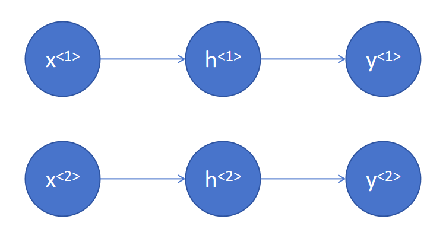
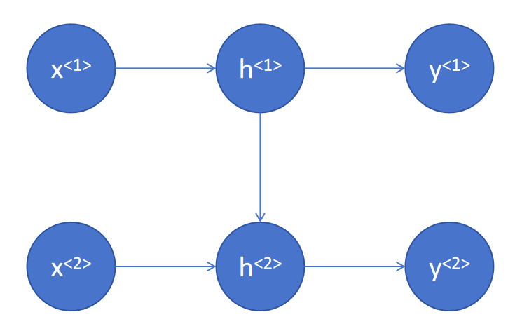
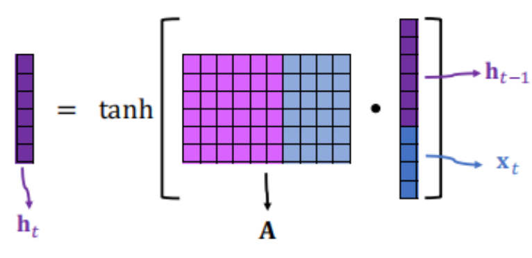
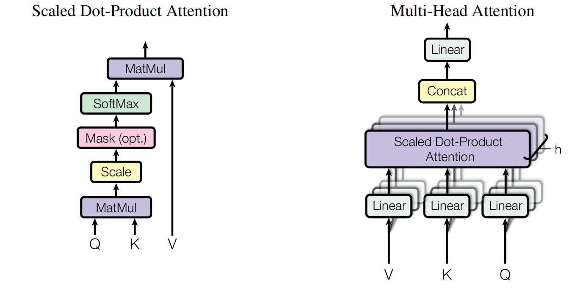
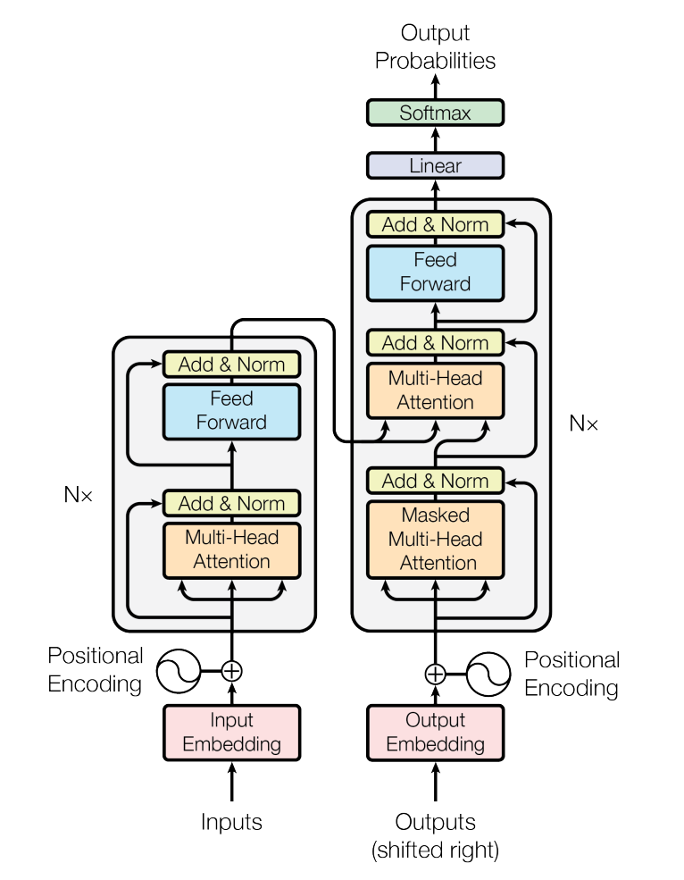
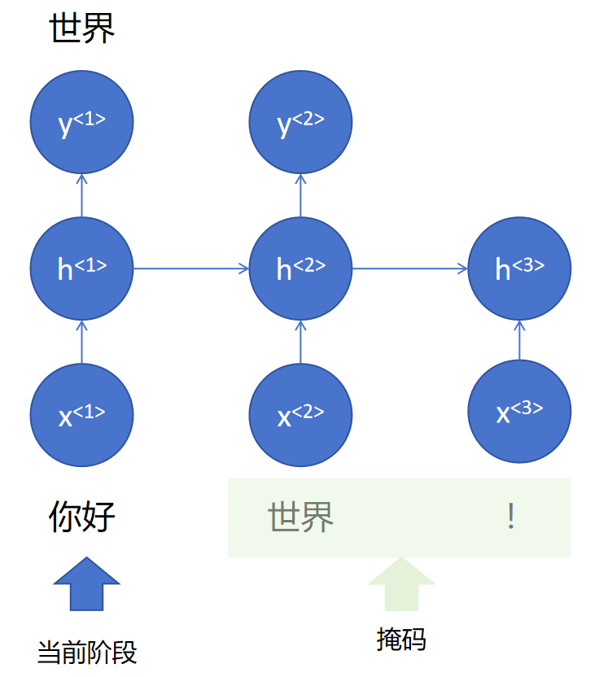
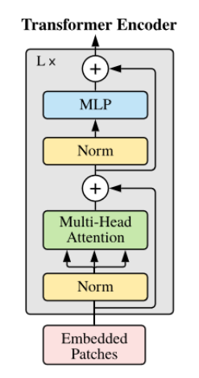
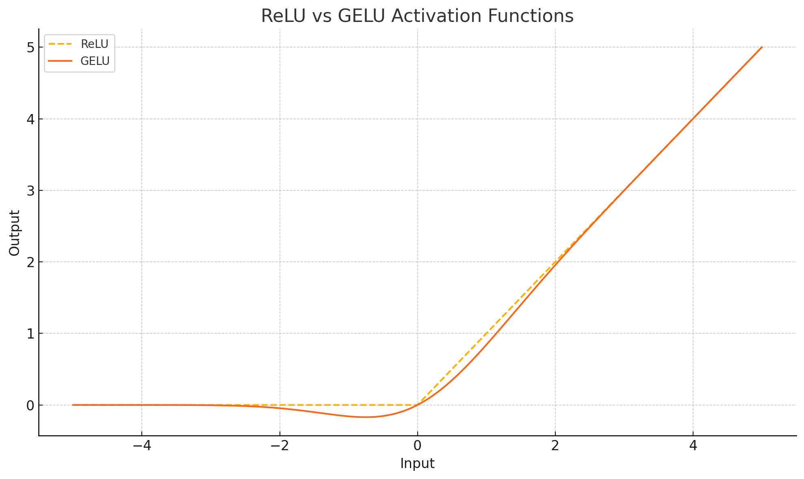

# 神经网络与深度学习4

## 从MLP到RNN

卷积神经网络CNN我们之前已经了解过了，是将一张图片输入到网络中后，使用卷积、池化、展平的操作后，再输入到全连接层中，输出这个图片中的信息（如物体类别、人脸等）。这个网络从输入到输出的过程中，是将图片一股脑地输入到网络中，同时提取所有像素中的信息（如灰度值/RBG等），结合这些像素的空间关系，最终让计算机理解图片中所包含的信息。

但到了自然语言处理，要让计算机理解“Hello world!”这句话，只用多层感知机MLP可不够，因为我们所说的话并不是同时蹦出来的，在我说出"Hello"的时候，后面可能是"Tom/Jerry"等，如果我让计算机使用卷积神经网络一直训练“Hello world”，让他理解这句话的意思是“你好世界”，但等我下一次输入为"Hello Tom"时，他又不知道我说的是什么意思了，除非将人们所有可能说的话全都让计算机进行训练（这几乎是不可能的）。

所以有了另一种想法，让计算机理解各个词语的意思，并且建立每个词语与其他词语之间的关系（比如我输入一个"Hello"，计算机可以对我接下来要输入的单词进行预测，"可能是Tom，可能是Jerry，可能是world..."），这样就可以让计算机不止理解词语的意思了，而是进一步到了每个句子的语义，这就是循环神经网络RNN的基本思想。这样做有个好处，想象一下，如果使用的是MLP来做语言模型我们只有将一整句话说完，计算机才能将我们说的话输入进去并理解我们的意思，而且他最多就是理解我们的意思，并不能根据我们说的话来作出合理的回复（因为CNN并没有理解词语之间关系的能力）；而RNN就不一样了，我们在说话的过程中，每说出一个词，计算机就可以根据我们当前输入的这个词来预测后面我们可能会接着说什么词，并且当我们的话说完后，它也可以理解我们这句话的意思并做出与我们这句话语义接近的回复。

### 编码(encoding)与解码(decoding)

在计算机的世界中，并不能直接理解"Hello"这个词的意思，也不能直接永这个词来进行训练，我们只有将每个词都变为数字，才能让计算机理解且进行训练。这里介绍三种编码方式：

1. 整数编码

将每个单词都用一个单一的数字进行表示。

缺点：维度太低，相当于一个一维的向量，没办法计算其与其他单词之间的关系；

2. 独热编码

独热编码之前我们介绍过，例如某句话中共有100个单词(token)，那我们在对这句话进行编码时，至少要将其建立为100维的向量，每个独特的单词都对应向量中的一个位置，比如"Hello world !"这句话，加上感叹号就可以视作3个token，那么我们可以将这些token使用独热编码：
"Hello":[1 0 0]; "world":[0 1 0]; "!":[0 0 1]

缺点：维度太高，要将世界上所有的token全都进行独热编码，那么维度不可估量，并且这些token编码后，每个token都与其他的token正交，同样无法计算token之间的关系。

3. 词嵌入

每个token都可以使用一个维度不算很高的向量(如512维)进行编码，编码后可以计算每两个token之间的相似度（如向量的点积、余弦相似度等），这样就可以让计算机理解token之间的关系了。

解码可视为编码的逆过程，”使用与编码同一套的字典“，将每个token的向量还原为token本身。

### RNN的结构

我们先来回顾一下MLP的结构，输入层，输入层进入到隐藏层，再从隐藏层输出，在两次先后MLP的预测之间，他们可以表示为：



<1>和<2>表示第一次和第二次的预测，可以看出两次预测之间没有任何关联。

但在RNN中：



当前轮次的输出都会与前面一次或几次的隐藏层相关，这样就建立起了先后顺序输入之间的关系，用数学公式可表示为：
$$
第一轮预测:h^{<1>}=f(w_{xh} x^{<1>} + b_{xh});y^{<1>}=f(w_{hy} h^{<1>} + b_{hy})
$$

$$
第二轮预测:h^{<2>}=f(w_{xh} x^{<2>} + \textcolor{red}{w_{hh} h^{<1>}} + b_{xh});y^{<1>}=f(w_{hy} h^{<2>}    + b_{hy})
$$

这种只和前一次隐变量相关的方法，通常被称为一阶马尔可夫过程。当然，在一句话中，每一次的检测也可能会跟前面几个隐变量相关，例如"我喜欢苹果"和“他喜欢菠萝”这两句话，“喜欢”后面分别是“苹果”和“菠萝”，因此不能单纯认为喜欢后面就一定是“苹果”或者“菠萝”，还要再往前看一次，如果对应的是“我”、“喜欢”，那么后面大概率会出现“苹果”；如果是“他”、“喜欢”，那么后面大概率会出现“菠萝”，以此类推。

将RNN画成矩阵的形式（详细过程可以参考：https://www.bilibili.com/video/BV1MNoRYEEVM/?spm_id_from=333.1007.top_right_bar_window_history.content.click）：



## 从RNN到transformer

### RNN的缺陷

就像上面所说的过程，RNN网络是通过前一个token和后一个token之间的关系，来让计算机理解这句话的含义，本质上是一个串行计算，即只有处理完前面的数据，才能接着处理后面的数据。这样会带来两个最明显的问题：由于是串行计算，因此每一轮的训练都会花费很长时间；在长时间的计算下，RNN会产生“遗忘”的问题，或者说“混淆度”升高，当一个token出来后，后面可能会跟着很多种可能性，这些可能性的概率又都大致相等，计算机就不知道该怎么选择了。

### Attention注意力机制

2017年的一篇文章《Attention is all you need》https://proceedings.neurips.cc/paper_files/paper/2017/file/3f5ee243547dee91fbd053c1c4a845aa-Paper.pdf引起了轩然大波，他不同于以往的RNN，这篇文章提出的注意力机制将训练速度和模型识别的准确率都提高了几个等级，而后基于注意力机制衍生出了各类大模型。

那什么是注意力机制呢？他和RNN又有什么区别呢？

我们先来了解一遍注意力机制的运作规律：

1. 首先还是词嵌入，将一句话中的各个token都编码为向量；
2. 对每句话中的各个token进行位置编码，并将位置编码与词向量进行相加，得到一个新的词向量，这个词向量就具有了该token的位置信息，这些词向量共同组成了一个词矩阵，词矩阵中的每一列都是一个词向量；
3. 使用Wq、Wk、Wv三个矩阵对2.中得到的词矩阵进行处理，得到三个新的矩阵Q(Query)、K(Key)、V(Value)（这里的矩阵运算在GPU中是并行计算，改进了RNN中串行计算的不足，大大加快了计算速度）；
4. 使用Q和K^T做点积，得到一个新的词矩阵，这样词矩阵中的每个词向量就都包含上下文信息了（多头注意力机制：使用多个Wq、多个Wk、多个Wv对词矩阵进行处理，给予他们多次学习的机会，得到新的词向量，这样模型就变得更加灵活了）；
5. 得到新的词矩阵之后，再经过比例放缩、掩码、softmax处理，并与V矩阵相乘，即可得到Attention最终的计算结果。论文中是这样表示的：

$$
\text{Attention} (Q,K,V)=\text{softmax}(\frac{QK^T}{\sqrt{d_k}})V,这里的d_k是词向量的维度
$$

​	如果是多头注意力机制，则将每个头的输出进行连接（有权连接），得到最终的多头输出：
$$
\text{MultiHead}(Q,K,V)=\text{Concat}(\text{head}_1,\text{head}_2,...,\text{head}_h)W^O
$$

$$
其中:\text{head}_i=\text{Attention} (QW_i^Q,KW^Q,VW_i^Q)
$$



### Transformer模型的结构

下图是《Attention is all you need》中所展示的Transformer模型的结构



这个结构中，左边可以视为编码器，右边是解码器，一眼看上去好像两边都差不多，只不过右边多了一点东西，我们先从编码器来看。从下往上：Input是输入的句子，将输入进行词嵌入——Embedding得到词向量，然后将位置编码——Positional Encoding加入词向量中得到新的词向量和词矩阵，使用多头注意力——Multi-Head Attention对词矩阵进行处理，再将结果和原词矩阵输入到一个残差和归一化网络中——Add&Norm（为了防止梯度消失），然后输入到前馈全连接层中——Feed Forward，并将前馈全连接层的输出和输入都输入到残差和归一化网络中，最终的输出又输入到解码器的多头注意力中。
然后再来看解码器，为什么多了一个掩码多头注意力——Masked Multi-Head Attention呢，还记得我们前面在RNN中说过，我们说话不可能一句话一下就全蹦出来了，都是一个字一个字的冒出来，而在这注意力机制的词嵌入部分，我们就是将一整句话全部输入到模型中进行训练，为了保证模型的预测效果（即根据当前的token预测后面的token），我们在解码器中就会将所有后面的内容全部掩盖，仅根据当前的输入来预测后面的输出，如下图所示：



有趣的是，《Attention is all you need》这篇文章所提出的注意力机制和Transformer架构，原本是用于做机器翻译工作的，这个模型在极短的训练时间内就可以达到比RNN更好的效果，在这之后，很多人看到了Transformer架构的潜力，对其进行改进，并最终出现了大语言模型。

### ViT——Vison Transformer

将原本Transformer拓展到了图片识别，最终结果也显示，在大规模图像数据上ViT比卷积神经网络对图像处理任务的效果更好。

与卷积神经网络不同的是，ViT会将输入图像（如224×224×3）切分成固定大小的Patch（通常为16×16×3），每个Patch被视作一个token。

1. 每个Patch进行展平操作、线性映射变为固定长度的Embedding向量；
2. 对这些Patch在原图像中的所处位置进行位置编码，使其具有空间属性；
3. 将图像序列数据送入标准Transformer Encoder中；
4. 在较大的数据集中进行预训练；
5. 在下游数据集上微调用于图像分类。

ViT中Transformer Encoder与原始Transformer Encoder的区别就在于：ViT先进行残差、标准化，然后再进入多头注意力和前馈全连接层（多层感知机MLP）。



在这里的多层感知机MLP中，其激活函数有所不同，传统最常用的激活函数是ReLU，但这里使用的激活函数叫做GELU(Gaussian Error Linear Unit)：
$$
\text{GELU}(x) = x \Phi (x)
$$
其中Φ(x)是标准正态分布的累积分布函数：
$$
\Phi (x) = \int_{-\infin}^{x} \frac{e^{-t^2/2}}{\sqrt{2\pi}}dt=\frac{1}{2}[1+\text{erf}(\frac{x}{\sqrt{2}})]
$$
这里的erf是误差函数：
$$
\text{erf}(x) = \frac{2}{\sqrt{\pi}}\int_0^x e^{-t^2}dt
$$
其与ReLU的区别：

```python
import numpy as np
import matplotlib.pyplot as plt
import torch
import torch.nn.functional as F

# 创建输入张量
x = torch.linspace(-5, 5, 500)

# 计算ReLU和GELU的结果
relu_output = F.relu(x)
gelu_output = F.gelu(x)

# 绘制激活函数曲线
plt.figure(figsize=(10, 6))
plt.plot(x.numpy(), relu_output.numpy(), label="ReLU", linestyle='--')
plt.plot(x.numpy(), gelu_output.numpy(), label="GELU")
plt.title("ReLU vs GELU Activation Functions")
plt.xlabel("Input")
plt.ylabel("Output")
plt.legend()
plt.grid(True)
plt.show()

```



从图中可以看出，相比于ReLU，GELU曲线光滑，在所有地方都连续、可微，并且与ReLU的样子很接近，在大规模模型（如Transformer、ViT、BERT）中的表现更好。


